# Connect to instance using the OCI Cloud Shell

### Using the OCI Cloud Shell to connect to the Linux instance using its public IP address.

1. Log in to the OCI Console and click on the **OCI Cloud Shell** icon to open the Cloud Shell console.
    
    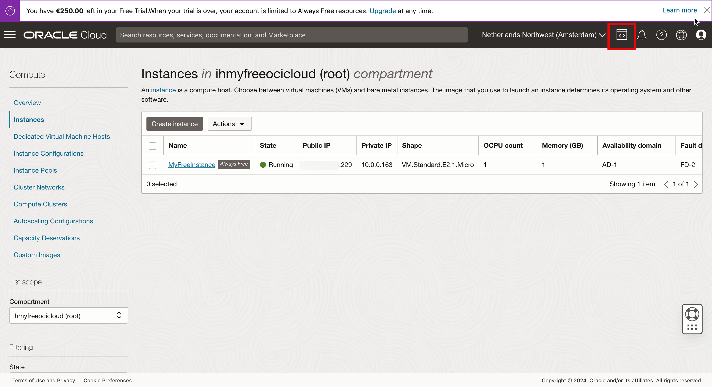

2. Click **Cloud Shell**.

    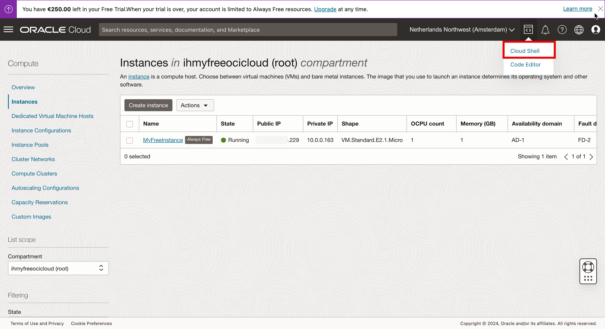

3. Make sure that the Cloud Shell window opens.

    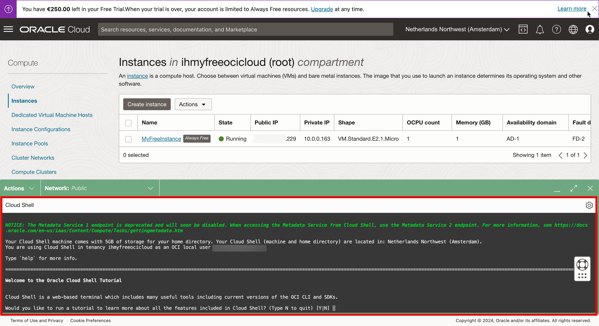

4. Enter *N* to skip the tutorial for now.

    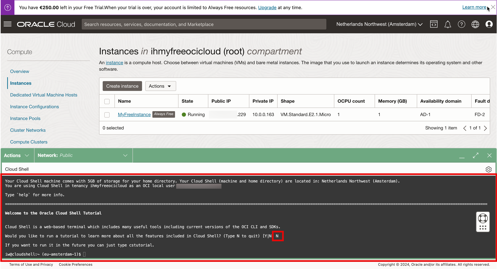

5. Run the *ls-l* command and see that we do not have the private key in the home folder, and then click the wheel to upload it.

    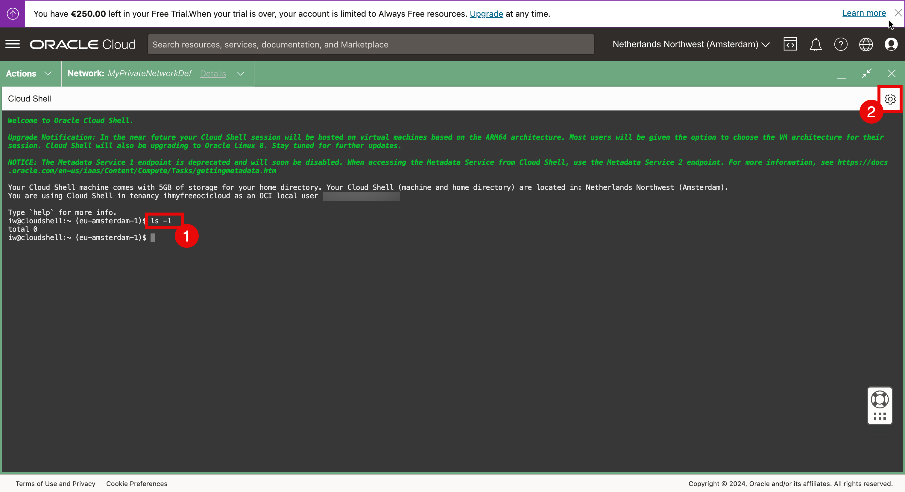

6. Click **Upload**.

    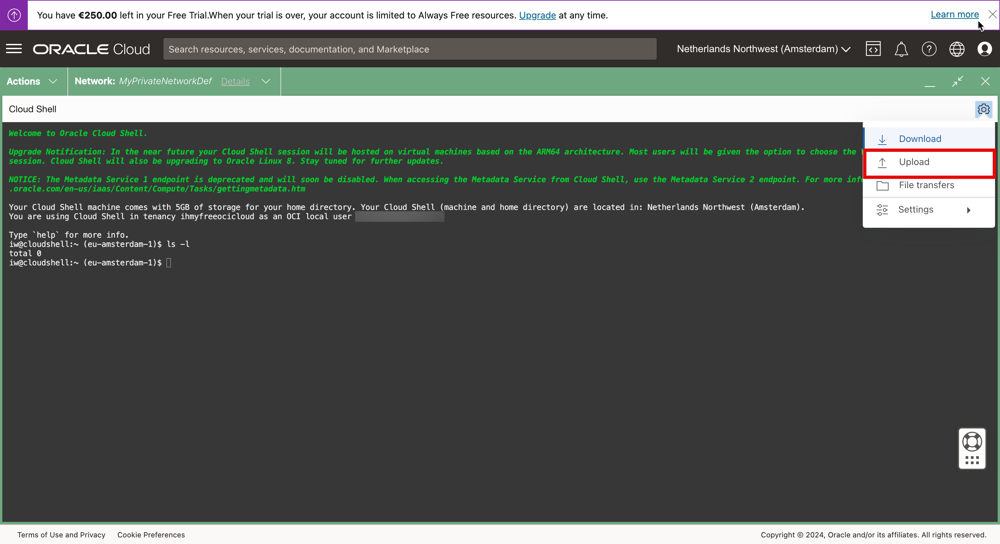

7. Click **Select from your computer**.

    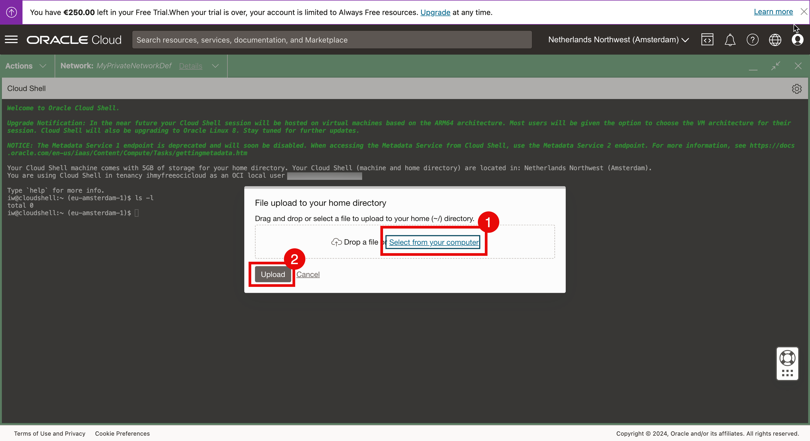

8. Select the private key from the local computer and then click **Open**.

    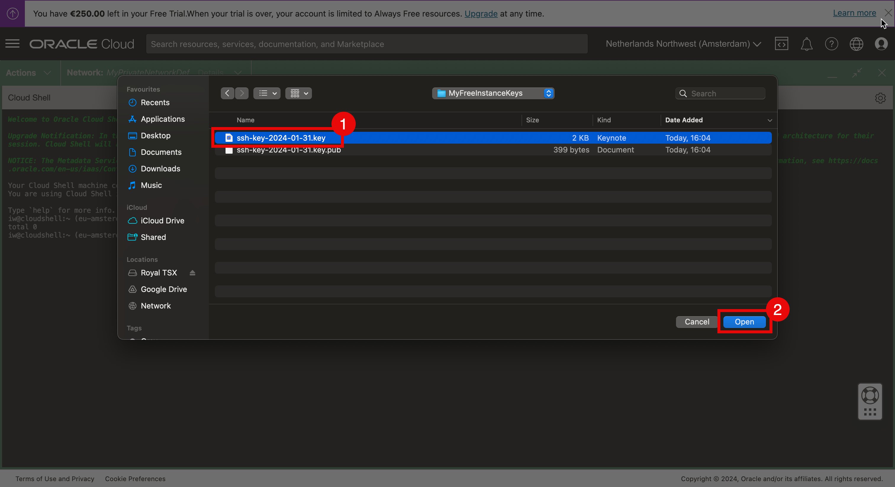

9. Review the key selected in the previous step and then click **Upload**.

    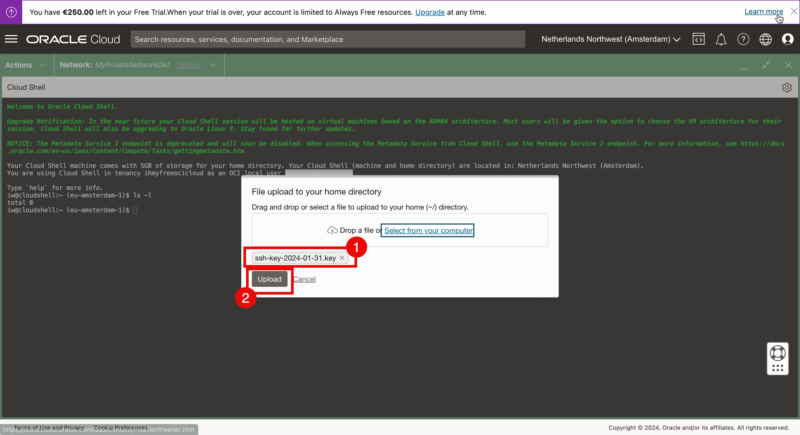

10. Make sure the upload is completed and then click **Hide**.

    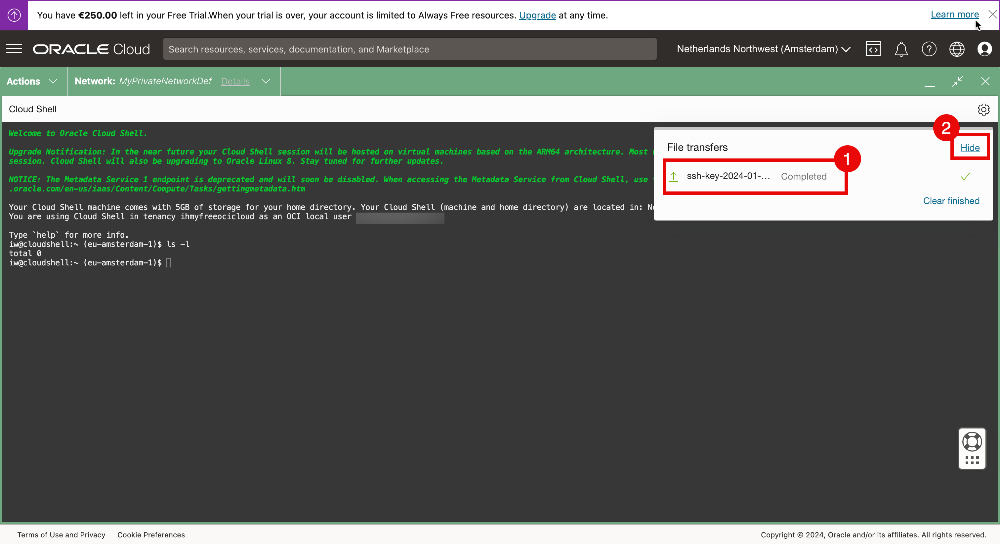

11. Run the *ls-l* command to check the private key.

    

12. For connecting to the instance:

    &emsp;(1) Restrict permissions of the private key and make sure the access is restricted before it can be used.  
            &emsp;&emsp;&emsp;&emsp; *chmod 600 ~/ssh-key.key*  
    &emsp;(2) Connect to the instance using the SSH command and specify the public key  
            &emsp;&emsp;&emsp;&emsp; *ssh -i ~/ssh-key.key opc@<PUBLIC_IP_ADDRESS>* 

    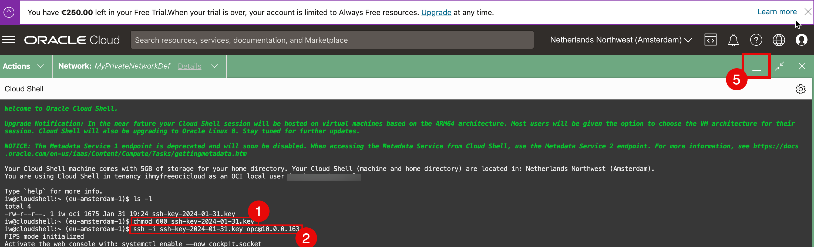
